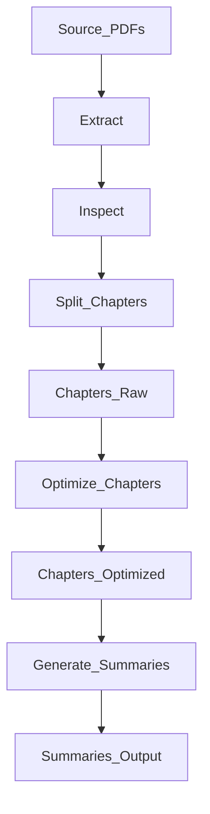

## 1. Stack
- Language: Python (`.py` scripts; `__pycache__/generate_summaries_pdf.cpython-314.pyc` observed → Python 3.14 runtime).
- No manifest file found (no package.json / go.mod / pyproject.toml / Cargo.toml at repo root or in pdf_extractor/).
- No frameworks observed. TODO: verify exact third-party libraries (no manifest to confirm).
- Single subproject folder: `pdf_extractor/`.

## 2. Directory map
| path | what lives there |
|---|---|
| `pdf_extractor/` | all scripts, source PDFs, and pipeline outputs |
| `pdf_extractor/chapters/` | 24 raw per-chapter `.txt` files (split from `output.txt`) |
| `pdf_extractor/chapters_optimized/` | 24 cleaned per-chapter `.txt` files (noise/exercises removed) |
| `pdf_extractor/summaries/` | 24 per-chapter `.json` summary files |
| `pdf_extractor/__pycache__/` | compiled bytecode cache |
| `pdf_extractor/*.pdf` | `Accounting.doc.pdf` (source), `Accounting_Chapter_Summaries.pdf` (generated output) |
| `pdf_extractor/output.txt` | raw extracted text (~2500 pages) from source PDF |
| `pdf_extractor/chapters_summaries.md` | combined human-readable chapter summaries |
| `pdf_extractor/prompth.md` | prompt/notes text file |
| `README.md` | repo root — pipeline overview |

## 3. Diagram

## 4. Component index
- [[Source_PDFs]]
- [[Extract]]
- [[Inspect]]
- [[Split_Chapters]]
- [[Chapters_Raw]]
- [[Optimize_Chapters]]
- [[Chapters_Optimized]]
- [[Generate_Summaries]]
- [[Summaries_Output]]

## 5. Entry points
- No `main.*` / `index.*` / `app.*` file exists at REPO_ROOT or in a `src/`/`app/` folder — none found.
- No dev server, build, or prod entry point observed — this is a batch script pipeline.
- Pipeline scripts run directly, in this order per README.md: `pdf_extractor/extract.py` → `pdf_extractor/split_chapters.py` → `pdf_extractor/optimize_chapters.py` → `pdf_extractor/generate_summaries_pdf.py`.
- Supporting/inspection scripts: `pdf_extractor/inspect_text.py`, `pdf_extractor/find_headings.py`, `pdf_extractor/find_chapters.py`.

## 6. Conventions
- Chapter files named `chapter_NN_<truncated_title>.txt`, zero-padded two-digit number, in both `chapters/` and `chapters_optimized/` (observed in directory listing).
- Optimized/summary artifacts mirror the same chapter stem across `chapters/`, `chapters_optimized/`, and `summaries/` (e.g. `chapter_01_Financial_Reporting_and_Accoun.*`).
- Summaries stored as one `.json` per chapter in `summaries/`, plus one combined `chapters_summaries.md`.
- All pipeline code lives flat inside `pdf_extractor/` (no `src/` nesting).

## 7. Where things go
- Add a new source PDF to process: place it in `pdf_extractor/`, extend `pdf_extractor/extract.py`.
- Add a new chapter-cleaning rule: edit `pdf_extractor/optimize_chapters.py` (outputs to `pdf_extractor/chapters_optimized/`).
- Change how chapters are detected/split: edit `pdf_extractor/find_chapters.py`, `pdf_extractor/find_headings.py`, or `pdf_extractor/split_chapters.py` (outputs to `pdf_extractor/chapters/`).
- Change summary generation/format: edit `pdf_extractor/generate_summaries_pdf.py` (outputs to `pdf_extractor/summaries/` and `pdf_extractor/chapters_summaries.md`).
- Add a new pipeline stage after optimization: create a new script in `pdf_extractor/` reading from `pdf_extractor/chapters_optimized/`.
